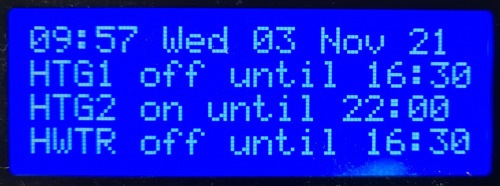

# Multi-Zone Heating Controller

## Introduction

This is a multi-zone heating controller written in the Berry scripting language designed to run on an ESP32 microcontroller running the latest Tasmota32.bin development branch firmware.

This heating controller gives independent time control over multiple channels or "zones" (1 zone per relay) on a 7 day weekly programme. Each channel/zone can have any number of programmed on/off schedules. 

## Features

* Multi heating zone support (only limited by the number of relays attached to the ESP32 microcontroller)
* Each heating zone can be programmed using 1 or more schedules
* Schedules and zones can be configured using a custom "Manage Heating" web page
* Custom labels can be specified for each zone
* Individual WS2812 LED pixels can indicate zone status 
* One physical push button per zone is supported with different actions available via single, double and tripple press.
* Each zone can be put into manual override. Several manual override modes are available (see Operating Modes below)
* A custom Tasmota "zone" command can be used to turn the zone on/off and switch mode. `zone1 1` turns zone 1 on. `zone1 {"mode": 5}` switches zone 1 to "All Day" mode. `zone2 {"mode": 0}` switches zone 2 to "Auto Mode".
* If Alexa/Hue emulation is enabled, when the power state of the relay is changed via Alexa (or MQTT or by pressing the Tasmota web UI relay buttons) the relevant heating zone's status is synchronised.
* A basic I2C LCD 20x4 screen is supported out of the box. The first line display date/time; the other 3 lines display on/off times for up to 3 zones.



### Operating Modes

0. ***Auto Mode*** - zone follows all programmed switching times specified in schedules
1. ***Boost Mode*** - zone turns on for 1 or 2 hours if off or extends time if on, then returns to previous mode
2. ***On Mode*** - zone constantly on irrespective of schedules
3. ***Off Mode*** - zone constantly off irrespective of schedules
4. ***Advance Mode*** - zone brought On if currently Off or Off if currently On until next schedule switching time
5. ***All Day Mode*** - zone operates from first On time until last Off time ignoring switching times in between

It has been tested with the following setup:

## Installation

### 1. Tasmota32 Firmware

Download the latest Tasmota ESP32 development branch firmware from:

<http://ota.tasmota.com/tasmota32/>

This heating controller was tested with Tasmota32.bin 

### 2. Configure Template

Using the Tasmota web UI, navigate to **Configuration | Configure Other**. Paste the following json template into the Template field. Tick "Activate" checkbox and "Save".

```json
{"NAME":"Tasmota ESP32","GPIO":[1,1,1,1,1,1,1,1,1,1,1,1,1,1,1,1376,0,640,608,224,0,225,226,32,0,0,0,0,33,34,1,1,1,0,0,1],"FLAG":0,"BASE":1}
```

The above template configures the GPIO pins as follows:

* GPIO19 - WS2812
* GPIO21 - I2C SDA 1
* GPIO22 - I2C SCL 1
* GPIO23 - Relay 1
* GPIO25 - Relay 2
* GPIO26 - Relay 3
* GPIO27 - Button 1
* GPIO32 - Button 2
* GPIO33 - Button 3

Navigate to **Configure Module** and ensure the above template is selected. Restart.

### 3. Configure Tasmota Options

The following backlog commands were executed:

Disable I2C driver 36:

`I2CDriver36 0`

Detach Buttons from Relays

`setoption73 1`

If you intend to use Alexa/Hue emulation, set friendly names for the relays:

`backlog FriendlyName1 Zone 1; FriendlyName2 Zone 2; FriendlyName3 Hot Water; FriendlyName4 $LED; Emulation 2`

If you live in a region with daylight saving you might want to specify a std/dst profile. Check out the Tasmota docs for Timezone, Timestd & Timedst. Here's an example profile for the UK:

`Backlog Timezone 99; timedst 0,0,3,1,1,60; timestd 0,0,10,1,2,0;  Latitude 55; Longitude 0.5`

Don't forget to configure MQTT if you wish to receive Heating Controller telemetry.

### 4. Upload scripts and supporting files

Navigate to **Consoles | Manage File system** and upload the following files from the repository:

[html.json](https://github.com/Beormund/Tasmota32-Multi-Zone-Heating-Controller/blob/main/html.json),
[heating.be](https://github.com/Beormund/Tasmota32-Multi-Zone-Heating-Controller/blob/main/heating.be), 
[display.be](https://github.com/Beormund/Tasmota32-Multi-Zone-Heating-Controller/blob/main/display.be),
[autoexec.be](https://github.com/Beormund/Tasmota32-Multi-Zone-Heating-Controller/blob/main/autoexec.be)

Options can be enabled/disabled by editing the autoexec file using **Consoles | Manage File system** and clicking on the edit icon next to the autoexec script.

```python
# Import heating.be from file system
import heating
# Set the number of heating zones (3 zones by default)
heating.options.zones = 3
# Basic support for I2C LCD 20x4/20x2 display
# Requires display.be to be uploaded to file system
heating.options.use_lcd = true
# Synchronise the relay web toggle button labels
# with the heating controller zone labels 
heating.options.sync_webbuttons = true
# WS2812 pin needs to be configured for LED
# pixel indicator support
heating.options.use_indicators = true
# Eable Tasmota/MQTT "zone" command to change
# power state ofh eating zones
heating.options.use_cmd = true
# Publish MQTT heating zone telemetry
heating.options.use_mqtt = true
# Initialise heating controller
var hc = heating.controller()
# Start the heating controller
hc.start()
```

## Operation

1. Use the Manage Heating web page to set zone labels, modes and schedules.


3. If physical buttons are configured, each button can operate an associated zone as follows. SINGLE press: zone will toggle from Auto to Advance mode. Auto on switches to Advance off and Auto off switches to Advance on etc. DOUBLE press: Zone switches mode in the following order with each double press: Auto -> All Day -> Const On -> Const Off -> Auto. TRIPPLE press: mode switches from Auto to Boost (1 hour), or if boost is activated, from Boost to Auto.
4. Ensure that schedule on/off times do not overlap as this may result in unexpected behaviour.
5. If there is a power cut or the microcontroller is restarted, zones will be restored to their last operating mode.
6. If you have an MQTT broker, the following is an example payload that the heating controller publishes when a zone changes state:

```yaml
17:00:01.609 MQT: wifi2mqtt/Heating-Controller3/tele/RESULT = `{"Heating":{"Mode":"Auto","Zone":3,"Until":"22:30 Sun 31 Oct 21","Power":"On","Label":"HWTR"}}`
```

## Known Issues

The scripts are large and if PSRAM is not present the heap may decrease to a point where the web UI becomes sluggish.

## Planned Enhancements

If memory and system resources allow, a nice to have would be a "schedule" command to create/update/delete schedules via console/MQTT.
