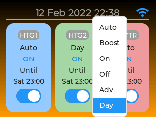

# Multi-Zone Heating Controller

## Introduction

This is a multi-zone heating controller written in the Berry scripting language designed to run on an ESP32 microcontroller running the latest Tasmota32.bin development branch firmware (or Tasmota32-lvgl.bin if you are using an LVGL touch screen).

This heating controller gives independent time control over multiple channels or "zones" (1 zone per relay) on a 7 day weekly programme. Each channel/zone can have any number of programmed on/off schedules. 

## Features

* Multi heating zone support (only limited by the number of relays attached to the ESP32 microcontroller)
* Each heating zone can be programmed using 1 or more schedules
* Schedules and zones can be configured using a custom "Configure Heating" web page
* Custom labels can be specified for each zone
* Individual WS2812 LED pixels can indicate zone status 
* One physical push button per zone is supported with different actions available via single, double and triple press.
* Each zone can be put into manual override. Several manual override modes are available (see Operating Modes below)
* A custom Tasmota "zone" command can be used to turn the zone on/off and switch mode (see below). 
* A custom Tasmota "schedule" command can be used to add/update/delete schedules (see below).
* If Alexa/Hue emulation is enabled, when the power state of the relay is changed via Alexa (or MQTT or by pressing the Tasmota web UI relay buttons) the relevant heating zone's status is synchronised.
* Two types of display are supported: 1) A basic HD44780 20x4 I2C LCD, or 2) a 320x240/480x320 SPI ILI9341 or similar with XPT2046 touch controller. If either of these devices is attached and correctly configured the heating controller will detect and use the appropriate display. NB for the touch screen the latest pre-compiled tassmota32-lvgl.bin development firmware is required. Before installing the heating controller app the touch screen should be calibrated using the [calibration app](https://github.com/arendst/Tasmota/pull/14459). Both screens can display up to 3 zones. The display is not enabled by default so you will need to enable the option on the Configure Heating page.

ILI9341 / XP2046 Display (using Tasmota32-lvgl.bin firmware)





Basic 4x20 HD44780 Display (using tasmota32.bin firmware)


### Operating Modes

0. ***Auto Mode*** - zone follows all programmed switching times specified in schedules
1. ***Boost Mode*** - zone turns on for 1 or 2 hours if off or extends time if on, then returns to previous mode
2. ***On Mode*** - zone constantly on irrespective of schedules
3. ***Off Mode*** - zone constantly off irrespective of schedules
4. ***Advance Mode*** - zone brought On if currently Off or Off if currently On until next schedule switching time
5. ***All Day Mode*** - zone operates from first On time until last Off time ignoring switching times in between

It has been tested with the following setup:

## Installation

### 1. Tasmota32 Firmware

Download the latest Tasmota ESP32 development branch firmware from:

<http://ota.tasmota.com/tasmota32/>

This heating controller was tested with Tasmota32.bin and Tasmota32-lvgl.bin (for touch screen support).

### 2. Configure Template

Using the Tasmota web UI, navigate to **Configuration | Configure Other**. Paste the following json template into the Template field. Tick "Activate" checkbox and "Save". You may need to adjust the template to match the number of components you have attached, and whether you are using I2C or SPI screen etc.

```json
{"NAME":"Tasmota ESP32","GPIO":[1,1,1,1,1,1,1,1,1,1377,1,1,1,1,1,0,0,640,608,224,0,225,226,32,0,0,0,0,33,34,1,1,1,0,0,1],"FLAG":0,"BASE":1}
```

The above template configures the GPIO pins as follows:

* GPIO13 - WS2812 2
* GPIO21 - I2C SDA 1
* GPIO22 - I2C SCL 1
* GPIO23 - Relay 1
* GPIO25 - Relay 2
* GPIO26 - Relay 3
* GPIO27 - Button 1
* GPIO32 - Button 2
* GPIO33 - Button 3

Navigate to **Configure Module** and ensure the above template is selected. Restart.

### 3. Configure Tasmota Options

The following backlog commands were executed:

Disable I2C driver 36:

`I2CDriver36 0`

Detach Buttons from Relays

`setoption73 1`

If you intend to use Alexa/Hue emulation, set friendly names for the relays:

`backlog FriendlyName1 Zone 1; FriendlyName2 Zone 2; FriendlyName3 Hot Water; FriendlyName4 $LED; Emulation 2`

If you live in a region with daylight saving you might want to specify a std/dst profile. Check out the Tasmota docs for Timezone, Timestd & Timedst. Here's an example profile for the UK:

`Backlog Timezone 99; timedst 0,0,3,1,1,60; timestd 0,0,10,1,2,0;  Latitude 55; Longitude 0.5`

Don't forget to configure MQTT if you wish to receive Heating Controller telemetry.

### 4. Upload Tasmota Application file (heating.tapp)

Navigate to **Consoles | Manage File system** and upload the following Tasmota Application from the repository:

[heating.tapp](https://github.com/Beormund/Tasmota32-Multi-Zone-Heating-Controller/blob/main/bin/heating.tapp)

## Operation

Navigate to Configuration | Configure Heating to set zone labels, modes, schedules, and options. Or click on the Zone summary info at the top of the Tasmota Home page.


* If physical buttons are configured, each button can operate an associated zone as follows. SINGLE press: zone will toggle from Auto to Advance mode. Auto on switches to Advance off and Auto off switches to Advance on etc. DOUBLE press: Zone switches mode in the following order with each double press: Auto -> All Day -> Const On -> Const Off -> Auto. TRIPLE press: mode switches from Auto to Boost (1 hour), or if boost is activated, from Boost to Auto.
* Ensure that schedule on/off times do not overlap as this may result in unexpected behaviour.
* If there is a power cut or the microcontroller is restarted, zones will be restored to their last operating mode.
* If you have an MQTT broker, the following is an example payload that the heating controller publishes when a zone changes state:

```yaml
17:00:01.609 MQT: wifi2mqtt/Heating-Controller/tele/RESULT = {"Heating":{"Mode":"Auto", "Zone":3, "Until":""2021-12-12T22:30:00", "Power":"On", "Label":"HWTR"}}
```

## Options

Options can be enabled/disabled by using the Configure Heating web page.

| Option    | Notes                                        |
:-----------|:---------------------------------------------|
`DISPLAY`       | Enables/Disables a configured display
`SYNC` | If enabled the Tasmota Relay Toggle buttons are renamed and kept in sync with heating zone names
`LED`       | If enabled, individual WS2812 LED pixels can act as zone indicators
`CMD`       | If enabled, the zone and schedule commands can be used via the Tasmota Console or MQTT
`MQTT`      | If enabled MQTT telemetry is appended to teleperiod and MQTT heating status messages are published

## Commands

Command|Parameters
:---|:---
`zone<x>`| publishes mqtt info for zone x<br>`0/off/false` = turn OFF<br>`1/on/true` = turn ON<br>`{"mode": m}` where m can be:<br>`0` (Auto)<br>`1` (Boost)<br>`2` (Const On)<br>`3` (Const Off)<br>`4` (Adv)<br>`5` (All Day)<br>When m = 1 (boost), specify hours: `{"mode": 1, "hours":2}` "hours" can be 1 or 2<br>Examples:<br>`zone1` (publish mqtt infor for zone 1)<br>`zone1 1` (turn zone 1 ON)<br>`zone2 {"mode": 5}` (switch zone 2 to All Day mode)<br>`zone3 {"mode": 1, "hours": 2}` (boost zone 3 for 2 hours)  
`zones`| publishes mqtt info for all zones  
`schedule<x>`| publishes mqtt info for schedule x.<br><br> To update a schedule specify a new payload.<br>Example: `schedule2 {"on":"06:30","zones":[1,1,1],"days":[0,1,1,1,1,1,0],"off":"08:30"}` updates schedule 2<br><br>To delete a schedule use the `delete` param.<br>Example: `schedule3 delete` deletes schedule 3<br><br>To add a new schedule use `schedule0` followed by a new payload<br>Example: `schedule0 {"on":"06:30","zones":[1,1,1],"days":[0,1,1,1,1,1,0],"off":"08:30"}` creates a new schedule. The schedule id will be auto-generated.<br><br>The payload on/off times must be in 24-hour HH:MM format and the off time must be later than the on time. Zones/Days must be a list of 1 or 0 values to indicate if the zones/days are enabled. `"days": [0,1,1,1,1,1,0]` indicates that the schedule should run Mon-Fri. `"zones": [1,1,0]` indicates that zones 1 & 2 are enabled for the schedule.
`schedules`| publishes mqtt info for all schedules  

## Known Issues

Please report any problems using Github Issues.

## Planned Enhancements

Implement custom command to update options. Support thermostat set temp/room sensor input (this will require berry Hue/Alexa & virtual relay integration). 

