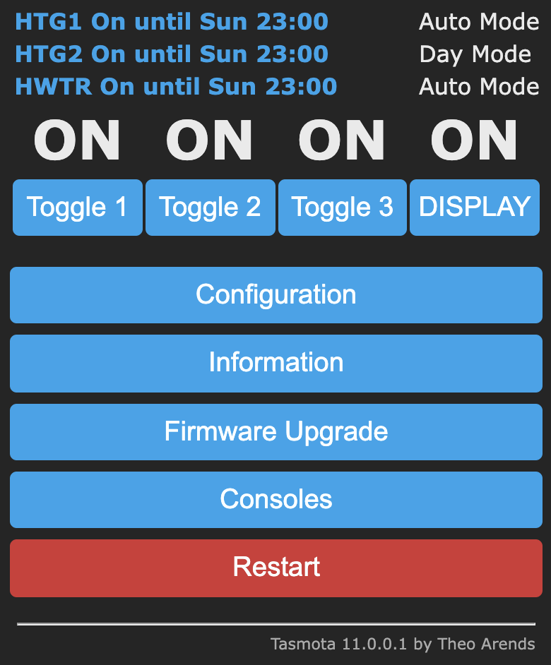
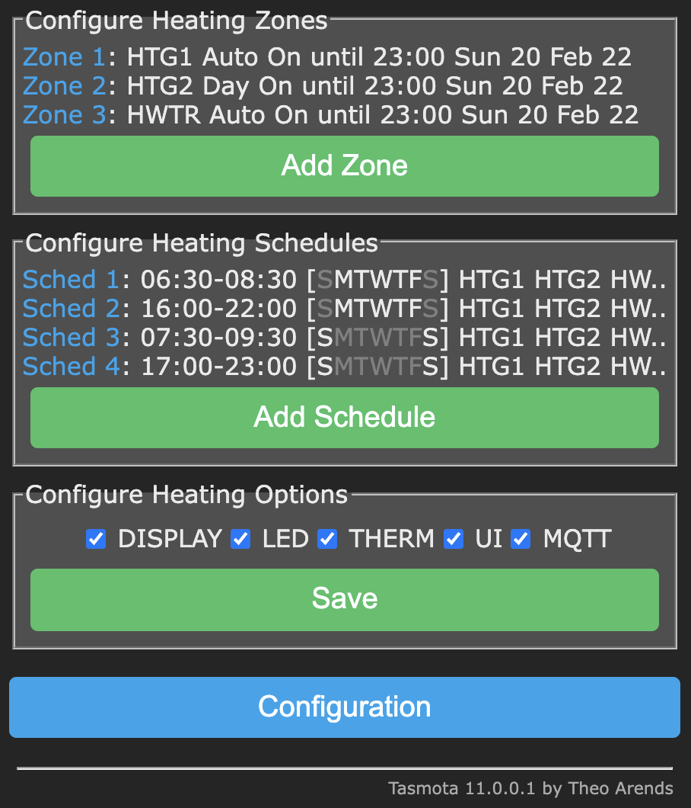
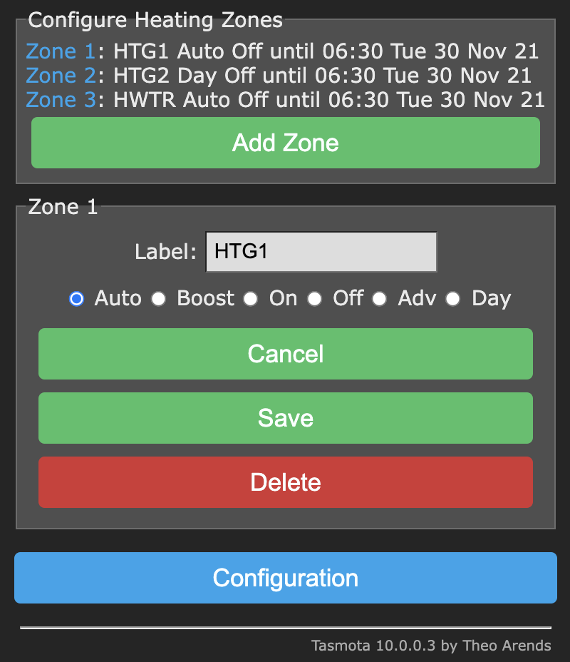
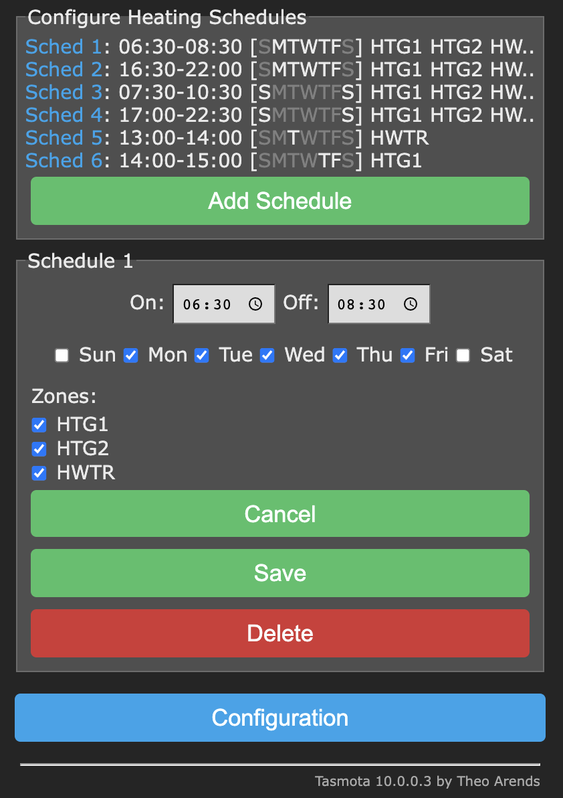
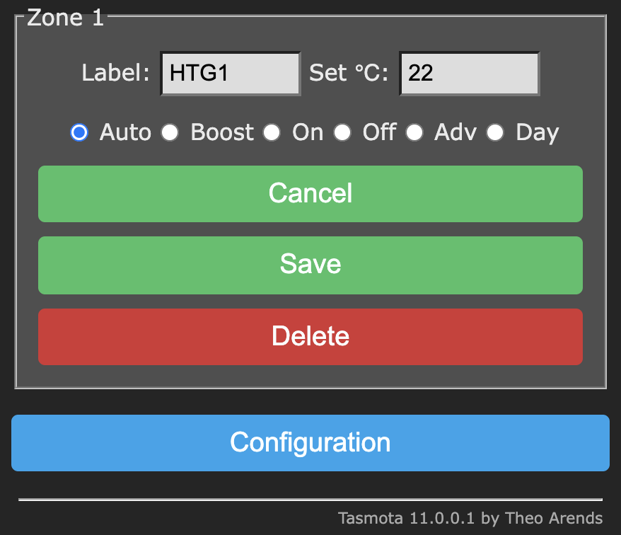

# Multi-Zone Heating Controller

## Introduction

This is a multi-zone heating controller written in the Berry scripting language designed to run on an ESP32 microcontroller running the latest Tasmota32.bin development branch firmware (or Tasmota32-lvgl.bin if you are using an LVGL touch screen).

This heating controller gives independent time control over multiple channels or "zones" (1 zone per relay) on a 7 day weekly programme. Each channel/zone can have any number of programmed on/off schedules. 

## Features

* Multi heating zone support (only limited by the number of relays attached to the ESP32 microcontroller)
* Each heating zone can be programmed using 1 or more schedules
* Schedules and zones can be configured using a custom "Configure Heating" web page
* Custom labels can be specified for each zone
* Individual WS2812 LED pixels can indicate zone status 
* One physical push button per zone is supported with different actions available via single, double and triple press.
* Each zone can be put into manual override. Several manual override modes are available (see Operating Modes below)
* The heating controller can be configured and controlled using custom commands (see below). The 'Configure Heating' UI is built entirely using these commands. It is therefore possible to build your own UI using these Tasmota commands.
* If Alexa/Hue emulation is enabled, when the power state of the relay is changed via Alexa (or MQTT or by pressing the Tasmota web UI relay buttons) the relevant heating zone's status is synchronised.
* Two types of display are supported: 1) A basic HD44780 20x4 I2C LCD, or 2) a 320x240/480x320 SPI ILI9341 or similar with XPT2046 touch controller. NB for the touch screen the latest pre-compiled tassmota32-lvgl.bin development firmware is required. Before installing the heating controller app the touch screen should be calibrated using the [calibration app](https://github.com/arendst/Tasmota/pull/14459). Both screens can display up to 3 zones. The display is not enabled by default so you will need to enable the option on the Configure Heating page.
* The controller support thermostat input. If the option is enabled, a target temperature can be set for each zone. A target temperature can also be set for each schedule which overrides the zone's target temperature whilst the schedule is running (see below for further details).

ILI9341 / XP2046 Display (using Tasmota32-lvgl.bin firmware)


Basic 4x20 HD44780 Display (using tasmota32.bin firmware)


### Operating Modes

0. ***Auto Mode*** - zone follows all programmed switching times specified in schedules
1. ***Boost Mode*** - zone turns on for 1 or 2 hours if off or extends time if on, then returns to previous mode
2. ***On Mode*** - zone constantly on irrespective of schedules
3. ***Off Mode*** - zone constantly off irrespective of schedules
4. ***Advance Mode*** - zone brought On if currently Off or Off if currently On until next schedule switching time
5. ***All Day Mode*** - zone operates from first On time until last Off time ignoring switching times in between

It has been tested with the following setup:

## Installation

### 1. Tasmota32 Firmware

Download the latest Tasmota ESP32 development branch firmware from:

<http://ota.tasmota.com/tasmota32/>

This heating controller was tested with Tasmota32.bin and Tasmota32-lvgl.bin (for touch screen support).

### 2. Configure Template

Using the Tasmota web UI, navigate to **Configuration | Configure Other**. Paste the following json template into the Template field. Tick "Activate" checkbox and "Save". You may need to adjust the template to match the number of components you have attached, and whether you are using I2C or SPI screen etc.

```yaml
{"NAME":"Tasmota ESP32","GPIO":[1,1,1,1,1,1,1,1,1,1377,1,1,1,1,1,0,0,640,608,224,0,225,226,32,0,0,0,0,33,34,1,1,1,0,0,1],"FLAG":0,"BASE":1}
```

The above template configures the GPIO pins as follows:

* GPIO13 - WS2812 2
* GPIO21 - I2C SDA 1
* GPIO22 - I2C SCL 1
* GPIO23 - Relay 1
* GPIO25 - Relay 2
* GPIO26 - Relay 3
* GPIO27 - Button 1
* GPIO32 - Button 2
* GPIO33 - Button 3

Navigate to **Configure Module** and ensure the above template is selected. Restart.

### 3. Configure Tasmota Options

The following backlog commands were executed:

Disable I2C driver 36:

`I2CDriver36 0`

Detach Buttons from Relays

`setoption73 1`

Disable useless internal chip temperature readings

`SetSensor127 0`

If you intend to use Alexa/Hue emulation, set friendly names for the relays:

`backlog FriendlyName1 Zone 1; FriendlyName2 Zone 2; FriendlyName3 Hot Water; FriendlyName4 $LED; Emulation 2`

If you live in a region with daylight saving you might want to specify a std/dst profile. Check out the Tasmota docs for Timezone, Timestd & Timedst. Here's an example profile for the UK:

`Backlog Timezone 99; timedst 0,0,3,1,1,60; timestd 0,0,10,1,2,0;  Latitude 55; Longitude 0.5`

Don't forget to configure MQTT if you wish to receive Heating Controller telemetry.

### 4. Upload Tasmota Application files (tapps)

Navigate to **Consoles | Manage File system** and upload the following Tasmota Application from the repository:

The heating controller host application (required)

[hc_host.tapp](https://github.com/Beormund/Tasmota32-Multi-Zone-Heating-Controller/blob/main/bin/)

The heating controller web UI (recommended)

[hc_wgui.tapp](https://github.com/Beormund/Tasmota32-Multi-Zone-Heating-Controller/tree/main/modules/hc_webgui/bin/)

Basic 4x20 dot matrix display support (optional)

[hc_lcd.tapp](https://github.com/Beormund/Tasmota32-Multi-Zone-Heating-Controller/tree/main/modules/lcd_display/bin)

LVGL Touchscreen display support (optional)

[hc_lvgl.tapp](https://github.com/Beormund/Tasmota32-Multi-Zone-Heating-Controller/tree/main/modules/lvgl_display/bin) (Requires tasmota32-lvgl.bin firmware)

Antiburn support (optional - see commands below)

[antiburn.tapp](https://github.com/Beormund/Tasmota32-Multi-Zone-Heating-Controller/tree/main/modules/antiburn/bin)

## Operation

Navigate to Configuration | Configure Heating to set zone labels, modes, schedules, and options. Or click on the Zone summary info at the top of the Tasmota Home page.






If the thermostat (THERM) option is enabled:




* If physical buttons are configured, each button can operate an associated zone as follows. SINGLE press: zone will toggle from Auto to Advance mode. Auto on switches to Advance off and Auto off switches to Advance on etc. DOUBLE press: Zone switches mode in the following order with each double press: Auto -> All Day -> Const On -> Const Off -> Auto. TRIPLE press: mode switches from Auto to Boost (1 hour), or if boost is activated, from Boost to Auto.
* Ensure that schedule on/off times do not overlap as this may result in unexpected behaviour.
* If there is a power cut or the microcontroller is restarted, zones will be restored to their last operating mode.
* If you have an MQTT broker, the following is an example payload that the heating controller publishes when a zone changes state:

```json
17:00:01.609 MQT: wifi2mqtt/Heating-Controller/tele/RESULT = {"HeatingZone":{"id":1,"target temp":22,"mode":0,"power":true,"room temp":21,"label":"HTG1","expiry":1645398000,"info":"HTG1 Auto On until 23:00 Sun 20 Feb 22"}}
```
## Thermostat Support

If the thermostat (THERM) option is enabled target temperatures can be set in the web UI (or via Tasmota commands/MQTT) at the zone level and at the schedule level. Together with room temperature readings the relays are controlled by applying the following rules:

* If a target temperature is set for a zone this will be used in the first instance unless a running schedule contains a target temperature in which case this overrides the zone's target temperature
* If a zone is in override mode the zone's target temperature will be used.
* If no room temperature is received via `HeatingZone<x> {"update": {"room": 22}}` the target temperature is ignored and the relay is controlled via the schedule's on/off times.
* If both a target and room temperature are specified, the controller will switch on the relay if the room temperature is below the target temperature; and switch off the relay if the room temperature is equal to or above the target temperature.

## Alexa Support

* If Hue emulation is enabled in the Tasmota UI an Alexa device will be created with the same name as the heating zone's label. Once enabled and the controller is restarted, ask Aslexa to "discover devices". 
* Note that Alexa will turn on/off the heating zone. So if a schedule is on or if the mode is constant ON then the zone will switch to Advance Off or Const Off and vice versa. If a zone is switched ON via Alexa but the room temperature is ABOVE the target temperature (if thermostat support is enabled) then the relay will NOT switch ON until the room temperature falls below the target temperaature. 

## Options

Options can be enabled/disabled by using the Configure Heating web page.

| Option    | Notes                                        |
:-----------|:---------------------------------------------|
`DISPLAY`       | Enables/Disables a configured display
`THERM` | If enabled target temperatures can be set for zones and schedules via the web UI.
`LED`       | If enabled, individual WS2812 LED pixels can act as zone indicators
`UI`       | If enabled, the heating controller can be managed via a custom Tasmota web UI. Note that if the UI is dsabled via the UI, the HeatingOptions console command must be used to re-enable the UI. 
`MQTT`      | If enabled MQTT telemetry is appended to teleperiod and MQTT heating status messages are published

## Commands

Command|Parameters
:---|:---
`HeatingZone<x>`| publishes mqtt info for `HeatingZone<x>`:<br>`HeatingZone1` -> `{"HeatingZone":{"mode":0,"label":"HTG1","expiry":1644737400,"info":"HTG1 Auto Off until 07:30 Sun 13 Feb 22","id":1,"power":false}}`<br><br>With power param:<br>`HeatingZone1 1`<br><br>where<br>`0/off/false` = turn OFF<br>`1/on/true` = turn ON<br><br>To update a zone's label or mode:<br>`HeatingZone<x> {"update": {"mode": 5, "label": "HTG1"}`<br><br>When mode = 1 (boost), specify hours:<br>`HeatingZone<x> {"update": {"mode": 1, "hours": 2}}`<br><br>To update the target or room temperature (together or individually):<br>`HeatingZone<x> {"update": {"target": 22.5, "room": 21.3}}`<br>`HeatingZone<x> {"update": {"target": 22}}`<br>`HeatingZone<x> {"update": {"room": 21}}`<br>NB: The THERM option needs to be enabled via the web UI or the HeatingOptions command. The `target` temperature key can optionally be included in the payload when creating a new zone.<br><br>To add a new zone:<br>`HeatingZone {"new": {"label": "2nd Flr", "mode": 1, "target": 22.5}}`<br><br>where mode :<br>`0` (Auto)<br>`1` (Boost)<br>`2` (Const On)<br>`3` (Const Off)<br>`4` (Adv)<br>`5` (All Day)<br><br>To delete a zone:<br>`HeatingZone<x> delete`<br><br>To show the currently running schedule for a given zone:<br>`HeatingZone<x> RunningSchedule`
`HeatingZones`| publishes info for all zones  
`HeatingSchedule<x>`| publishes mqtt info for `HeatingSchedule<x>`:<br>`HeatingSchedule1` -> `{"HeatingSchedule": {"id": 1, "on": "06:30", "zones": [1,1,1], "days": [0,1,1,1,1,1,0], "off": "08:30"}}`<br><br> To update a schedule:<br>`HeatingSchedule<x> {"update": {"on": "06:30", "zones": [1,1,1], "days": [0,1,1,1,1,1,0], "off": "08:30"}}`<br><br>To add a new schedule:<br>`HeatingSchedule {"new": {"on":"06:30","zones":[1,1,1],"days":[0,1,1,1,1,1,0],"off":"08:30", "target": 23.5}}`<br>NB: The THERM option needs to be enabled in the web UI or via HeatingOptions for the `target` key to take effect.<br><br>To delete a schedule use the `delete` param:<br>`HeatingSchedule<x> delete`<br><br>The payload on/off times must be in 24-hour HH:MM format and the off time must be later than the on time. Zones/Days must be a list of 1 or 0 values to indicate if the zones/days are enabled. `"days": [0,1,1,1,1,1,0]` indicates that the schedule should run Mon-Fri. `"zones": [1,1,0]` indicates that zones 1 & 2 are enabled and zone 3 is disabled for the schedule. The list of zones must match the number of zones configured.
`HeatingSchedules`| Publishes info for all schedules  
`RunningSchedules`| Publishes info for all currently running schedules
`HeatingOptions` | When no json payload is specified the command returns the current settings for all options:<br>`{"HeatingOptions": {"CMD": 1,"LED": 1,"DISPLAY": 1,"THERM": 1,"MQTT": 1}}`<br><br>`0` = OFF<br>`1` = ON<br><br>To set 1 or more options use a json payload and specify the option name as string and <br><br>`0/off/false` to turn option off<br>`1/on/true` to turn option on:<br><br>`HeatingOptions {"LED": 1, "Display": 1}`  
`HeatingLabels` | Publishes a list of zone labels:<br>`{"HeatingLabels": ["HTG1", "HTG2", "WATER"]}`  
`HeatingModes` | Publishes a list of heating modes:<br>`{"HeatingModes": ["Auto", "Boost", "On", "Off", "Adv", "Day"]}`  
`HeatingDays` | Publishes a list of week day names:<br>`{"HeatingDays": ["Sun", "Mon", "Tue", "Wed","Thu", "Fri", "Sat"]}`  
`Antiburn` | If an LCD/OLED display is being used and LVGL is present you can use this command to activate an antiburn screen wash. The screen will change from black -> Red -> Green -> Blue -> White every second for 30 seconds or until the screen is touched. This command requires the supplementary [Antiburn.tapp](https://github.com/Beormund/Tasmota32-Multi-Zone-Heating-Controller/tree/main/modules/antiburn/bin) to be uploaded to the file system. The antiburn command can be scheduled to run using a Timer and Rule (see Tasmota documentation for how to set up a timer to trigger a rule).

### MQTT Publications:

```yaml
21:12:18.608 CMD: HeatingZones
21:12:18.645 MQT: tasmota/stat/RESULT = {"HeatingZones":[{"id":1,"target temp":22,"mode":0,"power":true,"room temp":21,"label":"HTG1","expiry":1645398000,"info":"HTG1 Auto On until 23:00 Sun 20 Feb 22"},{"id":2,"target temp":23.4,"mode":5,"power":true,"room temp":21,"label":"HTG2","expiry":1645398000,"info":"HTG2 Day On until 23:00 Sun 20 Feb 22"},{"id":3,"target temp":null,"mode":0,"power":true,"room temp":null,"label":"HWTR","expiry":1645398000,"info":"HWTR Auto On until 23:00 Sun 20 Feb 22"}]}

20:57:29.606 CMD: HeatingZone1
20:57:29.627 MQT: tasmota/stat/RESULT = {"HeatingZone":{"id":1,"target temp":22,"mode":0,"power":true,"room temp":21,"label":"HTG1","expiry":1645398000,"info":"HTG1 Auto On until 23:00 Sun 20 Feb 22"}}

21:12:48.765 CMD: HeatingSchedules
21:12:48.804 MQT: tasmota/stat/RESULT = {"HeatingSchedules":[{"id":1,"target temp":22.5,"on":"06:30","zones":[1,1,1],"days":[0,1,1,1,1,1,0],"off":"08:30"},{"id":2,"target temp":23,"on":"16:00","zones":[1,1,1],"days":[0,1,1,1,1,1,0],"off":"22:00"},{"id":3,"target temp":null,"on":"07:30","zones":[1,1,1],"days":[1,0,0,0,0,0,1],"off":"09:30"},{"id":4,"target temp":null,"on":"17:00","zones":[1,1,1],"days":[1,0,0,0,0,0,1],"off":"23:00"}]}

21:08:07.383 CMD: HeatingSchedule1
21:08:07.410 MQT: tasmota/tele/RESULT = {"HeatingSchedule":{"id":1,"target temp":22.5,"on":"06:30","zones":[1,1,1],"days":[0,1,1,1,1,1,0],"off":"08:30"}}

21:03:10.315 CMD: RunningSchedules
21:03:10.338 MQT: tasmota/stat/RESULT = {"RunningSchedules":[{"id":4,"target temp":null,"on":"17:00","zones":[1,1,1],"days":[1,0,0,0,0,0,1],"off":"23:00"}]}

21:09:29.307 CMD: HeatingZone1 RunningSchedule
21:09:29.338 MQT: tasmota/stat/RESULT = {"RunningSchedule":{"id":4,"target temp":null,"on":"17:00","zones":[1,1,1],"days":[1,0,0,0,0,0,1],"off":"23:00"},"HeatingZone":{"id":1,"target temp":22,"mode":0,"power":true,"room temp":21,"label":"HTG1","expiry":1645398000,"info":"HTG1 Auto On until 23:00 Sun 20 Feb 22"}}

21:15:24.206 CMD: HeatingOptions
21:15:24.224 MQT: tasmota_5C3CA8/stat/RESULT = {"HeatingOptions":{"DISPLAY":1,"LED":1,"THERM":1,"UI":1,"MQTT":1}}

21:14:54.422 CMD: HeatingDays
21:14:54.437 MQT: tasmota_5C3CA8/stat/RESULT = {"HeatingDays":["Sun","Mon","Tue","Wed","Thu","Fri","Sat"]}

21:04:16.105 CMD: HeatingModes
21:04:16.124 MQT: tasmota/stat/RESULT = {"HeatingModes":["Auto","Boost","On","Off","Adv","Day"]}

21:06:35.509 CMD: HeatingLabels
21:06:35.526 MQT: tasmota/stat/RESULT = {"HeatingLabels":["HTG1","HTG2","HWTR"]}
```

## Known Issues

System resources are limited. If you are not using PSRAM you might need to be selective in the tapps you install.

## Planned Enhancements

LVGL touchscreen UI for managing zones, schedules, options and listing running schedules.
